# @oazmi/kitchensink

A messy modular collection of personal utility functions that I use all the time. <br>
Written in `Typescript` with `TypeDoc` documents generator, highly minifiable when bundled, and has no external dependencies.

> A wise billionaire once said: _whenever you encounter a ~~`(...func) => {tion}`~~ that's called more than twice, you should "let that **sink** in"_ <br>
> \- Musk le Elon abu Twitter et al...

## Installation

To get started for `node/npm` shadow repo clone jutsu the `npm` branch in your existing project directory:

```cmd
pnpm add -D github:omar-azmi/kitchensink_ts#npm
```

And now, import whatever the heck you like:

```ts
// import { antigravity } from "python@3.12"
import { setDotPath } from "jsr:@oazmi/kitchensink/dotkeypath"
import { pack } from "jsr:@oazmi/kitchensink/eightpack"
import { downloadBuffer } from "jsr:@oazmi/kitchensink/browser"
// or why not use a single import?
// import { setDotPath, pack, downloadBuffer } from "jsr:@oazmi/kitchensink"

const statement = { I: { am: { very: { stupidly: undefined } } } }
let bin_str = ""
setDotPath(statement, "I.am.very.stupidly", "defined")
if (statement.I.am.very.stupidly === "defined") bin_str += "kermit da leap of faith no jutsu"
downloadBuffer(pack("str", bin_str), "i am very smart.txt", "text/plain")
alert("plz download the virus text file")
```

The submodule docs are available on [github-pages](https://omar-azmi.github.io/kitchensink_ts/), for you to figure out the REST api yourself.

> Once your tradesecret&#x2122; functions are registered, stage the action transformation sequence, duel in the ancient egyptian era of merge conflicts, and finally Kermit neck rope <br>
> \- said Dumbledwarf **calmly**, knowing very well that MangoSoft was scheming to Copilot his consciousness into the copypasta ~~shadow~~ purple realm. <br>

## Non-mandatory example

```ts
/** TODO: someday, somewhere, sometime, somehow, something, sound, shall be around */
```

## Compatibility

Works with: `Deno 1`, `Deno 2`, `Browsers`, `Node >= 18`, `Cloudflare Workers`, `Bun?` (it's too ugly for consideration; for the longest time, it didn't even work on windows)

## Dino Specimen

<div style="max-width: min(100%, 384px);">


_**Specimen A**: I just needed an excuse to put this up._

</div>
